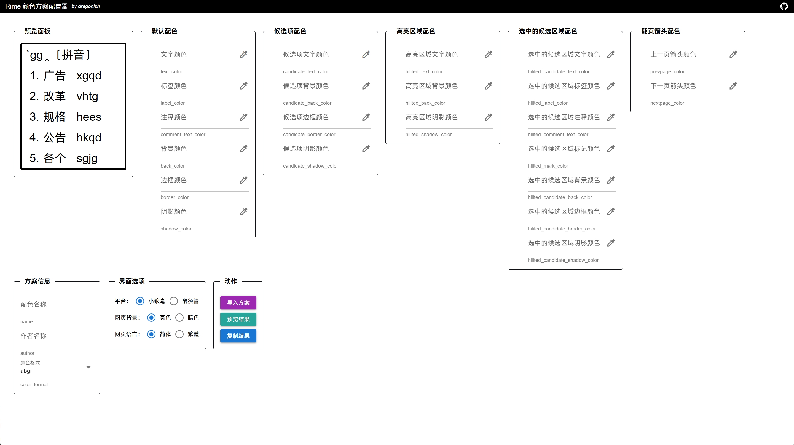

# rime-color-scheme-configurator

Rime 颜色方案配置器，用于配置小狼毫与鼠须管的颜色方案。

## 功能

- 支持同时配置小狼毫与鼠须管平台的颜色方案。
- 支持导入已有颜色方案。
- 允许在网页中暂存并加载历史颜色方案。

## Demo

- [在线 Demo](https://rime.dragonish.org/)

## 预览



## Docker 部署

```bash
# pull
docker pull giterhub/rime-color-scheme-configurator:latest

# run
docker run -d \
    --name rime-color-scheme-configurator \
    --restart unless-stopped \
    -p 80:80 \
    giterhub/rime-color-scheme-configurator:latest
```
